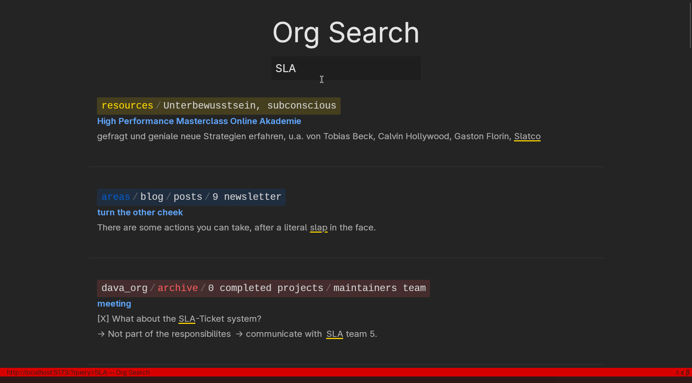
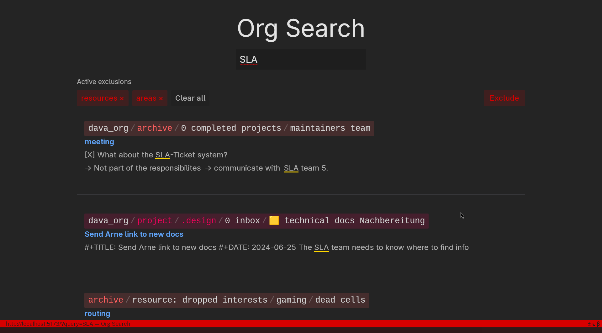
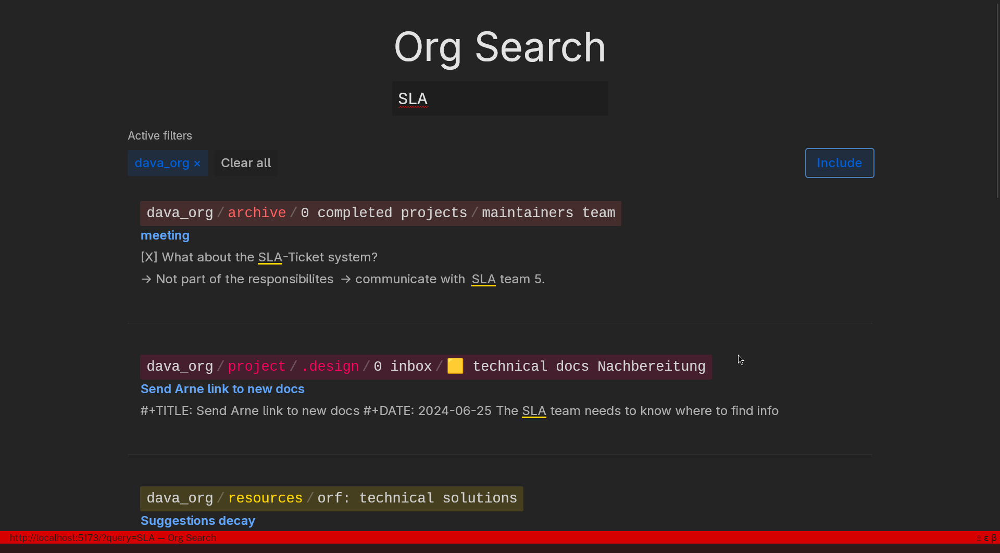

# Org Search

> search for my note-taking system

This react app provides a way do a full-text search over my whole note-taking system instantly.
The search is powered by an Elasticsearch that gets populated by [fscrawler](https://github.com/dadoonet/fscrawler) which ingests all of my org-mode notes, PDFs and more.



This search can be narrowed down with include and exclude filters:





## Stack

- React for the UI
- Tailwind for styling
- Vite for keeping it all together
- Elasticsearch as the search index
- [fscrawler](https://github.com/dadoonet/fscrawler) for indexing my file system of notes for Elasticsearch
- (kibana for managing Elasticsearch)

## Configuration
### Elasticsearch

To setup CORS with elasticsearch I had to add this configuration to my es
docker compose file:

```
- http.cors.enabled=true
- http.cors.allow-origin=https://org-search.neidel.xyz
- http.cors.allow-credentials=true
- http.cors.allow-headers=X-Requested-With,Content-Type,Content-Length,Authorization
- http.cors.allow-methods=OPTIONS,HEAD,GET,POST,PUT,DELETE
```

Because I'm not using authentication on my local network I also have:

```
- xpack.security.enabled=false
```

### Excluded paths

Paths that should never be matched can be configured in `excludePaths.config.json`.
Each entry is a JavaScript `RegExp` pattern to be excluded.
