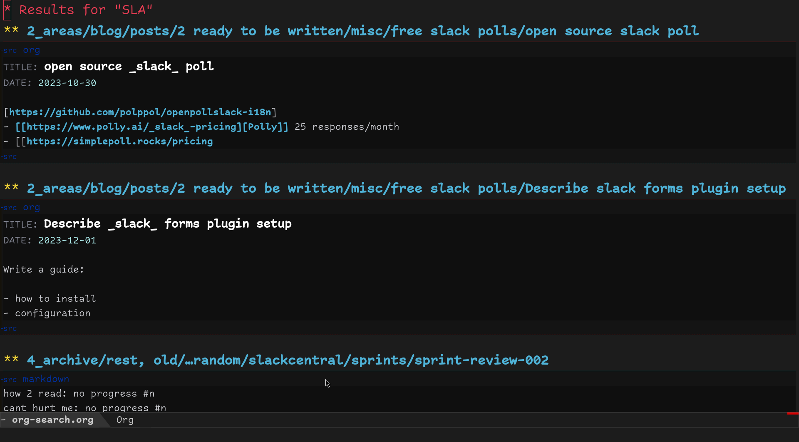
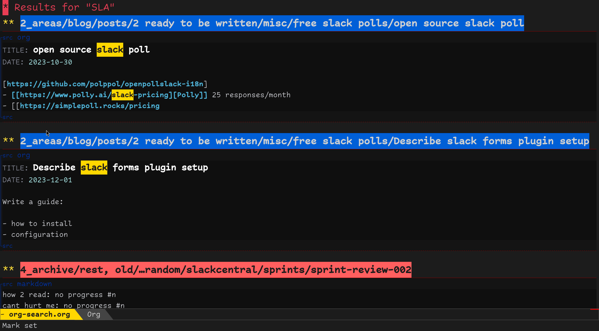
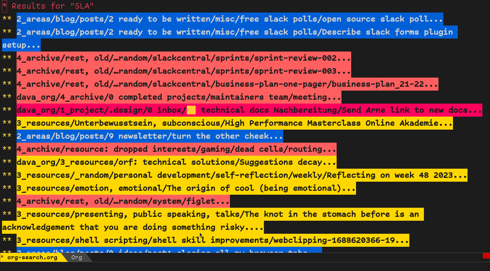

# Org Search

> search for my note-taking system

This app provides a way do a full-text search over my whole note-taking system instantly.
The search is powered by an Elasticsearch that gets populated by [fscrawler](https://github.com/dadoonet/fscrawler) which ingests all of my org-mode notes, PDFs and more.

By default you get serve a react app web interface:


This search can be narrowed down with include and exclude filters:


If you pass `?format=org` and a `&query=..` you get the same output formatted in org-mode:



If you pass `?format=ansi` and a `&query=..` you get a colorized version of the org-mode output:





Write it to a file:
```sh
curl -Ss "http://localhost:5173/?query=query&format=ansi" >org-search.org
```

And evaluate this elisp snippet to colorize the current buffer:
```elisp
(require 'ansi-color)
(ansi-color-apply-on-region (point-min) (point-max))
```

## Stack

- React for the web UI
- Tailwind for styling
- Vite as transpiler and local development server
- Node.js as a production server
- Elasticsearch as the search index
- [fscrawler](https://github.com/dadoonet/fscrawler) for indexing my file system of notes for Elasticsearch
- (kibana for managing Elasticsearch)

## Development

To run locally:
```sh
make
```

To deploy I use:
```sh
make deploy
```

The files are synced into a docker container setup like this:
```sh
docker run -d --name org-search --network br0 --ip 192.168.178.33 -v /mnt/user/appdata/org-search:/app node:25-alpine sh -lc "cd /app && npm ci && PORT=80 npm start"
```

Nginx proxy manager then turns ip into a full-fledged domain with HTTPS.

### Elasticsearch

To setup CORS with elasticsearch I had to add this configuration to my es
docker compose file:

```
- http.cors.enabled=true
- http.cors.allow-origin=https://org-search.neidel.xyz
- http.cors.allow-credentials=true
- http.cors.allow-headers=X-Requested-With,Content-Type,Content-Length,Authorization
- http.cors.allow-methods=OPTIONS,HEAD,GET,POST,PUT,DELETE
```

Because I'm not using authentication on my local network I also have:

```
- xpack.security.enabled=false
```

### Excluded paths

Paths that should never be matched can be configured in `excludePaths.config.json`.
Each entry is a JavaScript `RegExp` pattern to be excluded.
